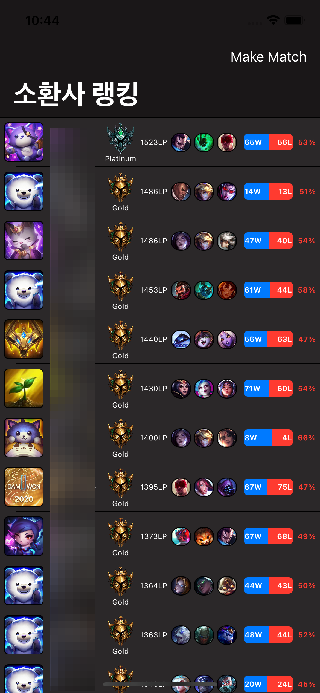
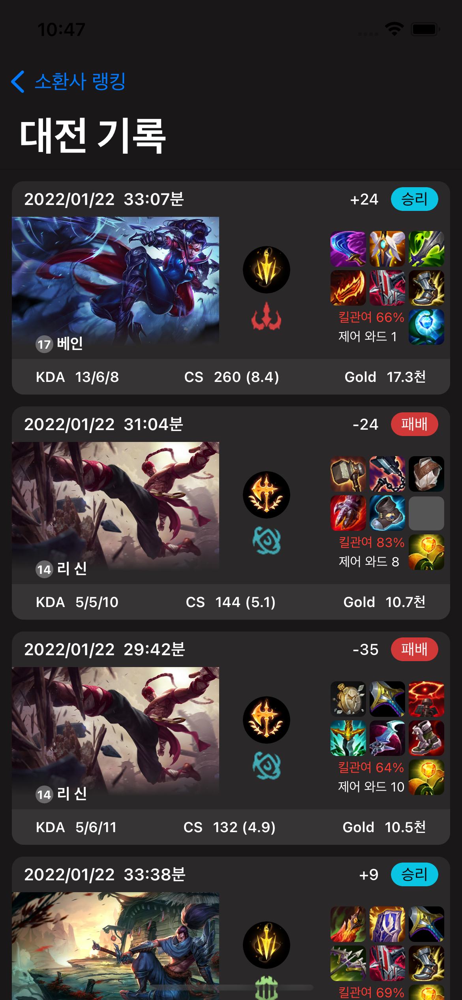

# Beljaby
 

## Features

- [x] Get User custom game current Rank
- [x] Get User custom game Match History
- [x] Apply Combine
- [ ] Apply MVVM
- [ ] Get User custom game Match History Detail

## Requirements

- Kingfisher
- Firebase
- Alamofire
- RealmSwift
