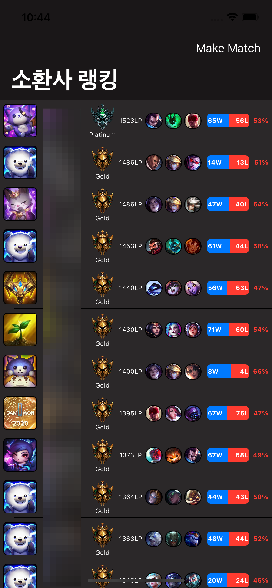
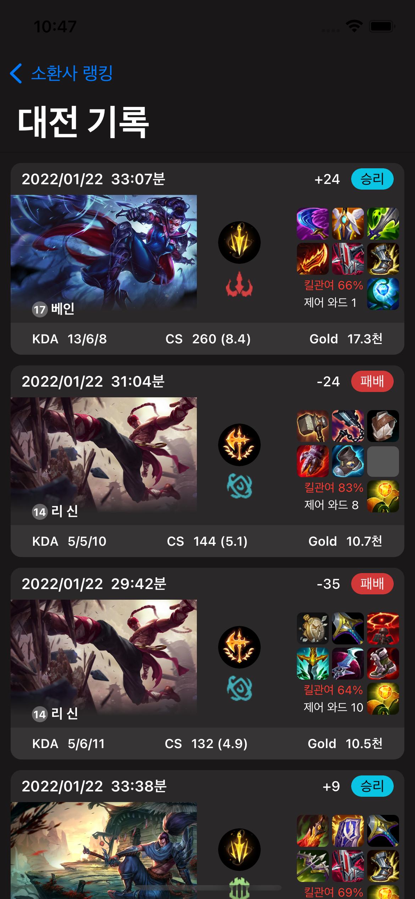
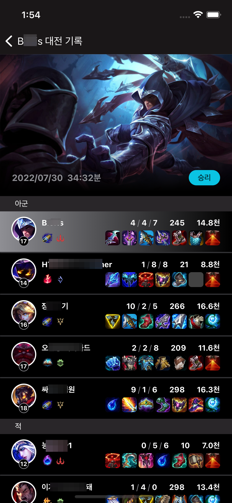
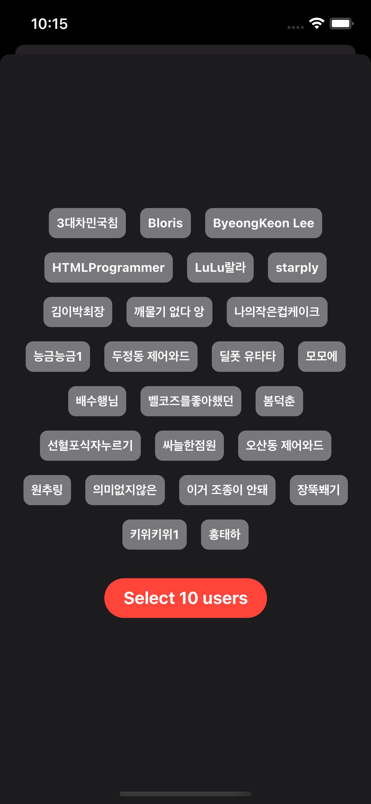

# Beljaby
 

## In Progress

- Apply MVVM

## Features

- [x] User custom game current Rank View
- [x] User custom game Match History View
- [x] User custom game Match History Detail View (swiftUI) 
- [x] Apply Combine
- [ ] Apply MVVM

## Requirements

- Kingfisher
- Firebase
- Alamofire
- RealmSwift
